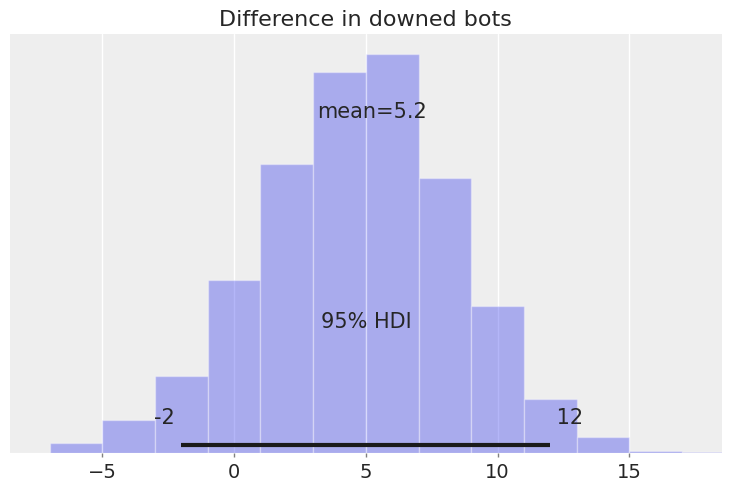

After studying Bayesian Statistics for a while, I revisited [an experiment I conducted](https://sorkanius.github.io/valorant_aim/) using VALORANT data.

The experimental setup was:

* 30 bots were configured in the Range. They were static, had armor (150 HP), and the difficulty was set to medium.
* Shots were fired at two distances: **close** and **long**. Three weapons were used: **Sheriff, Phantom, and Vandal**.
* For each configuration, 10 measurements were taken:  
  3 weapons × 2 distances × 10 measurements = **60 samples**.  
  The order was randomized to reduce bias.

---

## Methodology

Unlike the previous analysis that focused on specific questions, here the goal is to work with a **generative model**. This allows us to answer questions while properly quantifying uncertainty using simulations, which are central to Bayesian statistics. The computations are based on a simple causal model.

### The Data

After importing libraries and preparing the data, we obtain the following sample:

<table border="1" class="dataframe">
  <thead>
    <tr style="text-align: right;">
      <th>weapon</th>
      <th>distance</th>
      <th>bots</th>
      <th>prop</th>
      <th>round</th>
      <th>distance_weapon</th>
    </tr>
  </thead>
  <tbody>
    <tr><td>2</td><td>2</td><td>18</td><td>0.600000</td><td>1</td><td>4</td></tr>
    <tr><td>3</td><td>2</td><td>19</td><td>0.633333</td><td>2</td><td>5</td></tr>
    <tr><td>3</td><td>1</td><td>26</td><td>0.866667</td><td>3</td><td>2</td></tr>
    <tr><td>1</td><td>1</td><td>16</td><td>0.533333</td><td>4</td><td>0</td></tr>
    <tr><td>3</td><td>1</td><td>23</td><td>0.766667</td><td>5</td><td>2</td></tr>
  </tbody>
</table>

Relevant columns:

* **distance_weapon**: indicator (0–2 = close with Sheriff, Phantom, Vandal; 3–5 = long with same order).  
* **round**: round number (1–60).  
* **bots**: number of bots downed (0–30).  

---

## Causal Thinking

The following DAG (Directed Acyclic Graph) describes the data-generating process.  
We expect the number of downed bots to be influenced by:

1. **Weapon** – Sheriff (pistol), Phantom (faster fire, lower damage), Vandal (higher damage).  
2. **Distance** – accuracy decreases with longer distance.  
3. **Round** – aim may improve with practice.  


Since the experiment was randomized, we assume no additional associations.

Thinking causally helps communicate assumptions. Not specifying a causal structure is still imposing one implicitly, often incorrectly. Starting simple and adding complexity is usually best.

## The Model

We build a binomial regression, with a logistic link:

`log(p/(1-p)) = beta_i + round·j`

Where *beta_i* is different for each combination of distance and weapon (*i*). *round* is the coefficient associated with the learning as the rounds progressed. *j* is the round but normalized to the maximum rounds played. An uninformative prior is used. 

Model structure in **PyMC**:


---

### Sampling

Using uninformative priors, the prior expectation is extreme (all 0 or all 30 bots), which motivates choosing better priors in the future:


Posterior traces look good (no strong correlation between samples):


Parameter summary:

<table border="1" class="dataframe">
<thead>
<tr><th></th><th>mean</th><th>sd</th><th>hdi_2.5%</th><th>hdi_97.5%</th><th>r_hat</th></tr>
</thead>
<tbody>
<tr><th>beta[0]</th><td>0.35</td><td>0.15</td><td>0.06</td><td>0.63</td><td>1.0</td></tr>
<tr><th>beta[1]</th><td>0.45</td><td>0.17</td><td>0.12</td><td>0.79</td><td>1.0</td></tr>
<tr><th>beta[2]</th><td>1.33</td><td>0.17</td><td>1.00</td><td>1.66</td><td>1.0</td></tr>
<tr><th>beta[3]</th><td>0.12</td><td>0.14</td><td>-0.14</td><td>0.40</td><td>1.0</td></tr>
<tr><th>beta[4]</th><td>0.10</td><td>0.14</td><td>-0.16</td><td>0.37</td><td>1.0</td></tr>
<tr><th>beta[5]</th><td>0.80</td><td>0.16</td><td>0.47</td><td>1.11</td><td>1.0</td></tr>
<tr><th>round</th><td>0.33</td><td>0.19</td><td>-0.03</td><td>0.69</td><td>1.0</td></tr>
</tbody>
</table>

All `r_hat=1`, indicating convergence. Instead of focusing only on means, Bayesian models allow exploring full distributions and their uncertainty.

Comparison of observed data vs. posterior distribution:


Cumulative distribution:


### Parameters

Plotting the betas (after logistic transform):


Interpretation:

* Accuracy decreases at long distance.  
* Vandal accuracy is higher than Phantom or Sheriff.  
* Phantom and Sheriff are similar.

Unlike before (bot counts), this reflects **accuracy probabilities**, which are more intrinsic.

#### Round

In the previous analysis, we removed this variable from the model after testing its significance. What we will be doing now is averaging our accuracy from different weapons and distances in order to:

1. Measure the improvement in accuracy after playing 60 rounds, both in p.p. and %.
2. See how this change in accuracy translates to how the number of downed bots changes.

```The starting accuracy is: 63%, after playing 60 rounds, the accuracy was: 70%```

Numbers are nice, but let's work with distributions to better measure uncertainty. We do this in p.p. (percentage points):    

    

And in relative increase (%):


    

After training, we observe an overall increase in accuracy, `12%` on average. Most of the density is positive, but there is significant uncertainty: 95% of the probability mass lies between `-2.2%` and `+25%`.

Now, let’s see how this increase in precision translates to the number of downed bots. We do this by simulating rounds with the precisions before and after training. Since we are not using averages but whole distributions, the uncertainty in our `p`’s is carried over to the number of downed bots. This was not done in the previous analysis, since the confidence intervals there referred to the mean of the distribution, not the full distribution.


Although the average difference is positive, there is substantial uncertainty in how many additional bots we expect to down after training.

Since we have the full distribution, we can ask questions such as:

After playing 60 rounds, what is the probability of downing more bots than without training?

    The probability is 67%


After playing 60 rounds, what is the probability of downing **5 or more** bots than without training?

    The probability is 28%


Querying a model like this is just awesome!

---

#### Distance

We now take a look at the effect of distance. We average precision across weapons and check how much accuracy is lost as we move further from the target.

This is the decrease in accuracy in percentage points:


    


These absolute differences translate to the following relative difference (%):


    


At long distance, accuracy decreases by `13%` on average, and this difference is clearly negative. The 95% HDI ranges between `6.6%` and `19%`. As done before, we can query our model and check how much probability mass lies below zero:

    The area below zero is 99.975%


The model strongly suggests that the effect of distance is negative.

But knowing the decrease in accuracy is one thing—what does this decrease, and its uncertainty, mean for the number of downed bots?


    


Even though the effect of distance is mostly negative, the difference in downed bots is not so straightforward: the 95% HDI is between `-11` and `4`.

This may surprise the reader, but the following exercise clarifies that due to randomness in the process, higher precision does not always guarantee more downed bots.

Let’s run a simulation where Player 1 has `p=0.8` and Player 2 has `p=0.7`. Player 1 is more accurate, but if they play 1000 rounds, will Player 1 always down more bots than Player 2?

I encourage the reader to think before looking at the results.

    Player 1 had more downed bots than Player 2 in 790 out of 1000 rounds.
    The 95% HDI of the difference is [-4, 9] and the mean is 3.0 bots.


Aha! Player 1 is not always the winner, even with `+10 p.p.` accuracy. Hopefully this sheds light on the results obtained earlier.

Note that, even though both players’ accuracies were fixed numbers, there is still uncertainty in the outcome due to the data-generating process. In our earlier model, when checking for differences, we used the whole posterior distribution of accuracies (at close and long distances), not just their mean values. This is crucial, since our estimate of the difference in downed bots reflects not only randomness in the process but also the uncertainty in our estimates of precision!

---

#### Weapons: Vandal vs Phantom

Last but not least, let’s compare the Phantom and the Vandal.

In terms of downing bots, here are the relative differences:


    

Overall, we see that accuracy with the Vandal is `31%` higher than with the Phantom. All of the probability mass is above 0%, and the 95% HDI is between `19%` and `44%`.

This difference in accuracy translates to the following difference in downed bots:



    

On average, we should expect to down `5.2` more bots with the Vandal.

    The probability of downing fewer bots with the Vandal than with the Phantom is: 6.4%


We finish the analysis by showing the distribution of downed bots with the Phantom and the Vandal at both close and long distances:


