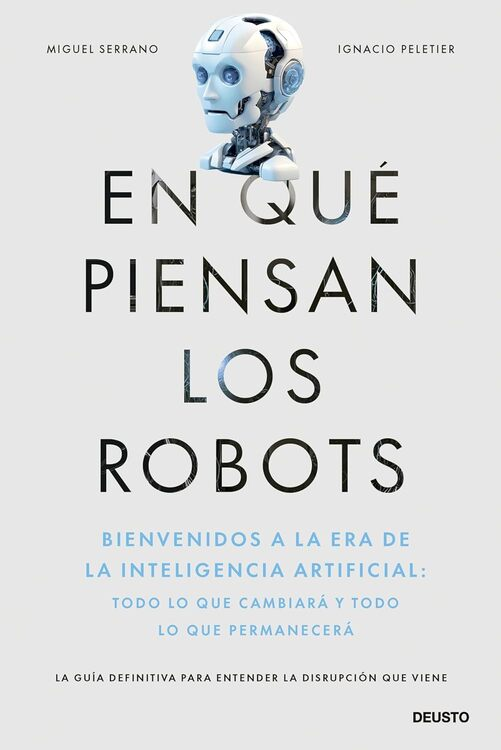

## 📘 *En qué piensan los robots* — An Artificial Intelligence Book for Everyone

Artificial Intelligence is no longer just a theme from science fiction movies — it is shaping our everyday lives. From recommendation algorithms and delivery apps to medical robots and virtual assistants like ChatGPT, AI has become a **daily presence**. But with these innovations come urgent ethical questions:  

- How do we prevent algorithms from reinforcing bias and discrimination?  
- Who is accountable if an AI system makes a mistake in healthcare?  
- Should we trust the future of humanity to a small group of tech executives and investors?  

### Why This AI Book Matters
*En qué piensan los robots* is written for **anyone who wants to understand artificial intelligence and machine learning** without needing a technical background. It explores both the opportunities and the challenges of AI, offering readers clear insights into:  

- The fundamentals of AI and machine learning  
- Real-world applications of algorithms in business and society  
- The ethical dilemmas and responsibilities of building and using AI  
- How each of us can take part in shaping a responsible AI future  

Instead of treating AI as something distant or overly technical, this book brings the debate closer to home. It provides the tools to understand how algorithms work, what they mean for our lives, and why **ethical AI is everyone’s responsibility**.  

👉 Get your copy now on [Amazon](https://www.amazon.es/qu%C3%A9-piensan-los-robots-inteligencia/dp/8423437590).

## Press Coverage

- **RTVE Radio 5** – Interview with Ignacio Peletier (Jan 30, 2025)  
  Ignacio Peletier talks about the present and future of robots, highlighting how they are becoming increasingly integrated into daily life. [Listen here](https://www.rtve.es/play/audios/la-entrevista-de-radio-5/entrevista-radio-5-ignacio-peletier-30-01-25/16426800/)

- **RNE – La Cuadratura del Círculo** – Do robots think like humans?  
  This episode discusses how artificial neural networks are inspired (or not) by the human brain, featuring Ignacio Peletier and Miguel Serrano. [Listen here](https://www.rtve.es/play/audios/la-cuadratura-del-circulo/piensan-robots/16283438/)

- **Cadena SER** – "AI won't take your job…"  
  Miguel Serrano explains that it's not AI that will take jobs, but the people who use it, discussing ethical challenges, machine creativity, and digital literacy. [Listen or read more](https://cadenaser.com/nacional/2024/10/18/la-ia-no-te-quitara-el-trabajo-lo-hara-una-persona-que-utilice-la-ia-la-advertencia-de-un-experto-sobre-el-futuro-de-la-inteligencia-artificial-cadena-ser/)

- **ComputerWorld** – "It's very biased to say that artificial intelligence will take our jobs"  
  ComputerWorld features a critical reflection on the idea that AI will completely replace humans. [Read the article](https://www.computerworld.es/article/3558889/es-muy-sesgado-decir-que-la-inteligencia-artificial-va-a-quitarnos-el-trabajo.html)

- **RNE – La Cuadratura del Círculo** – When AI became afraid  
  This episode addresses philosophical dilemmas about AI, its potential threat to humanity, and ethical concerns, with insights from Miguel Serrano. [Listen here](https://www.rtve.es/play/audios/la-cuadratura-del-circulo/robots-conciencia-humanidad-peligro/16346615/)

- **COPE – Imagina 2025**  
  A New Year special exploring future scenarios in technology, economy, and society, mentioning the relevance of the book. [Listen here](https://www.cope.es/programas/programas-especiales/audios/espera-nuevo-ano-vuelve-escuchar-imagina-2025-angel-correas-carla-otero-20250101_3070889.html)

- **YouTube – Fundación Abante Video**  
  A video discussing topics related to the book and AI debates. [Watch video](https://www.youtube.com/watch?v=9Oiz9HG92x8)
