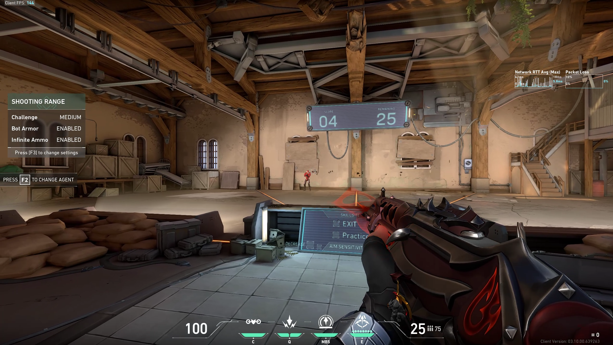
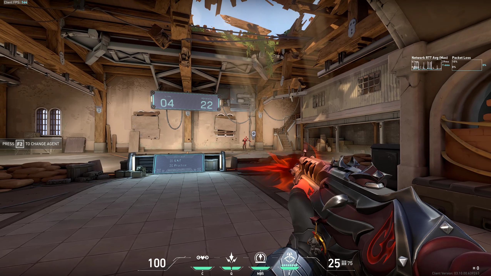
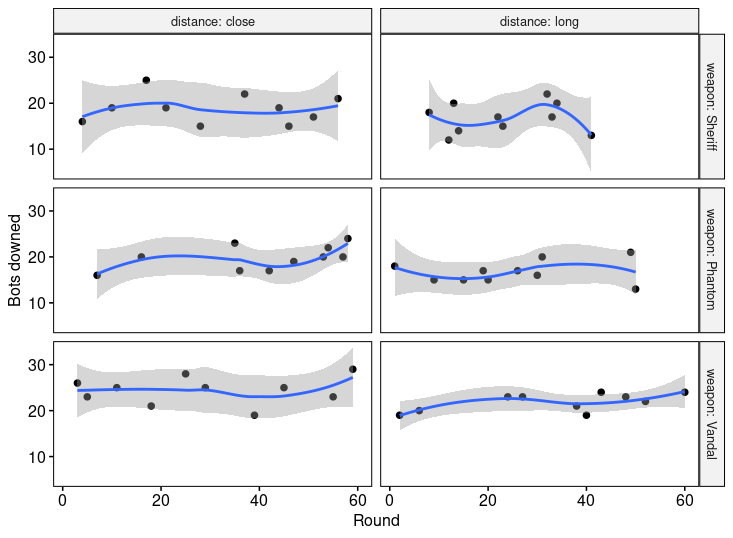

VALORANT is a tactical free-to-play first-person shooter developed by Riot Games and launched in June 2020. Given my love for the game, I worked on the experiment design, data collection, and analysis of a simple setup. The analysis aims to answer the following questions:

* Which weapon am I better with?  
* Does distance affect the number of bots I am able to shoot down?  
* Am I actually better with one weapon at close distance and with a different one at a longer distance?  
* As the rounds progressed, was I actually getting better?  

## Experiment Setup  

The experiment setup was the following:  

In the range, 30 bots were configured. They were static and had armor on (150 HP). The difficulty was set to **medium**.  

The shots were fired at two different distances labeled as "close" and "long," shown in the pictures below:  

  
*Close distance*  

  
*Long distance*  

Three different weapons were used: Sheriff, Phantom, and Vandal.  

For each configuration, 10 measurements were taken: `3 weapons x 2 distances x 10 measurements = 60 samples`. The order was randomized to reduce bias.  

## Plotting the Data  

Here is a plot of the distribution of downed bots per distance and weapon:  

  
*Distribution of downed bots in different configurations*  

It can be observed that there are differences between close and long distance. Also, the Vandal produced better results than the other two weapons. Later, it will be checked whether these differences are statistically significant and, if so, they will be quantified.  

Another interesting point to check is the interaction between weapons and distance. In other words, am I better with one weapon at close distance and another at long distance? Or does my accuracy decrease less with one weapon than with another? The following plot shows these differences and tries to answer the question visually:  

  
*Interaction between weapon and distance*  

Again, the decrease in the number of bots downed at long distance can be seen. There seems to be some interaction between distance and weapon type, especially with the Phantom, which produced better results at close distance than the Sheriff, but at long distance both weapons performed fairly similarly. This interaction will later be checked for statistical significance.  

Finally, here is the plot of the number of bots downed as the samples were taken:  

  
*Evolution of downed bots as samples were collected*  

Later, it will be checked if this slope is different from zero, in order to see whether I was getting better or worse as the rounds progressed.  

## Analysis  

Two-way ANCOVA (Analysis of Covariance) was used to analyze the effects of each variable: `weapon`, `distance`, and `round`.  

Before running the analysis, the assumptions of ANCOVA were checked.  

### Linearity Assumption  

Linearity was assessed by visual inspection of the covariate (`round`) for each available group:  

  
*Linearity assumption plot*  

The smoothing method used was *loess* (locally weighted smoothing). The plots are more or less linear, with some exceptions.  

### Homogeneity of Regression Slopes  

To proceed with ANCOVA, it is important to check that there is no interaction between the covariate and the grouping variables. That is, the slope in the previous plot should be the same for each group. The p-value obtained was `0.59`, indicating that this interaction is not statistically significant.  

### Normality of Residuals  

The Shapiro-Wilk Normality Test was run on the residuals of the model, producing a p-value of `0.937`, which is not significant; thus, the normality of the residuals is assumed.  

### Homogeneity of Variances  

Levene's test was used to check whether the variance of the residuals was equal across groups. The test yielded a p-value of `0.482`, which is not significant; therefore, homogeneity of residual variances is assumed.  

### Two-Way ANCOVA  

Now that all assumptions were met, the two-way ANCOVA was run on the data. Here is the summary of the ANOVA table:  

| Effect          | DFn  | DFd  | F      | p        | p < 0.05 |  
| --------------- | ---- | ---- | ------ | -------- | -------- |  
| round           | 1    | 53   | 2.408  | 0.127    | NO       |  
| weapon          | 2    | 53   | 21.982 | 1.12e-07 | YES      |  
| distance        | 1    | 53   | 10.568 | 0.002    | YES      |  
| weapon:distance | 2    | 53   | 0.202  | 0.818    | NO       |  

Both the effect of `round` and the interaction term (`weapon:distance`) are not significant. This means that as the rounds progressed, the number of bots downed did not increase, and the effect of distance on the number of bots downed did not depend on the weapon.  

An F-test was run with the previous model and a reduced one, which excluded the interaction term and `round`. The test yielded a non-significant p-value of `0.4306`, with statistic `F(53, 56) = 0.9345`, meaning that both models are statistically the same.  

### Pairwise Comparisons  

Using the reduced model, a Tukey HSD (Honest Significant Difference) test was run to quantify the differences between groups. Here are the results:  

* The differences between the Phantom and the Sheriff were not significant (p-value = `0.8645`).  
* The Vandal produced an average of `5.30` more bots downed than the Sheriff. This result is significant (p-value = `0.0000004`). The 95% Confidence Interval is (`3.1954, 7.4046`).  
* The Vandal produced an average of `4.85` more bots downed than the Phantom. This result is significant (p-value = `0.0000024`). The 95% CI is (`2.7454, 6.9546`).  
* At long distance, the average number of bots downed was `2.5667` **less** than at close distance. This result is significant (p-value = `0.0006838`). The 95% CI is (`1.1368, 3.9965`).  

## Conclusions  

1. The Vandal produced significantly better results than the other weapons.  
2. Both the Sheriff and the Phantom produced similar results, which is surprising given how different the weapons are.  
3. The degradation in accuracy due to shooting at longer distance was the same across weapons.  
4. There was no significant improvement as more rounds were completed.  

## Disclaimer  

* It is very important to note that the data analyzed comes from one player (me) and that the conclusions might not apply to other players, although the same analysis could be run for others.  
* Shooting at bots in the range is not the same as playing against other people (who actually shoot back), so this analysis is limited in that regard.  
* All the code is available on [my GitHub](https://github.com/Sorkanius/articles/tree/master/valorant_aim)   
* If you want to see me play, here are some [VALORANT clips]( https://www.youtube.com/channel/UCYj6rQZTnRH0p6xi3qWJa_A)  

I hope you found this analysis interesting. Feel free to reach out if you have any questions or are interested in more!  
